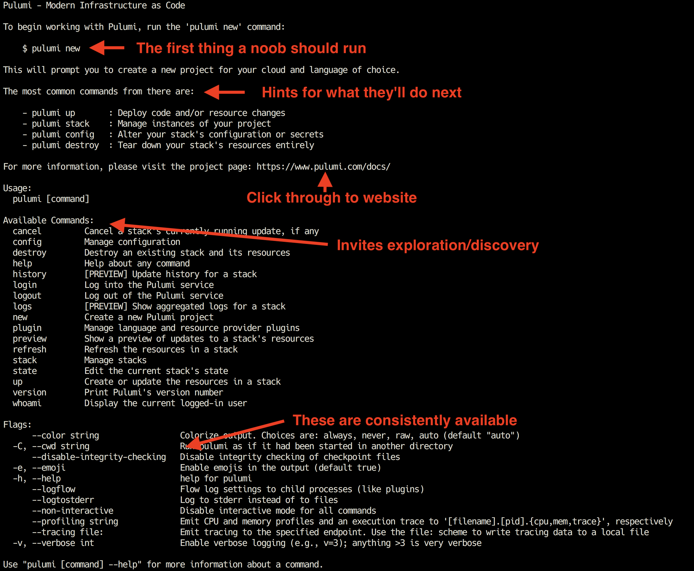
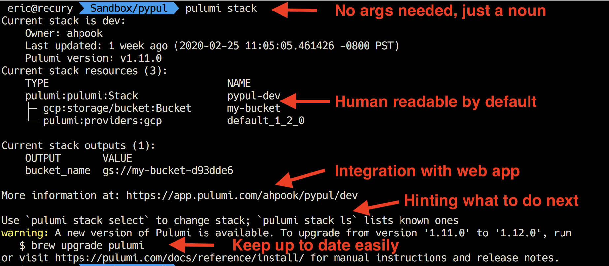

# Relay CLI RFC - March 2020

## Stakeholders

* **Recommenders:** Eric0 
* **Agreers:** 
* **Performers:** 
* **Inputers:** 
* **Deciders:** 

## Problem

We expect that most of our users will want to interact with Relay via an "as code" experience, but we currently do not have a clear picture of what that should look like. This doc attempts to provide design specifications and detailed workflows to address that issue.

## Summary

The Puppet Relay CLI should provide the primary way that _power users_ interact with the service. Its functionality should focus on the key workflows that _workflow and step authors_ need to be successful with the product. A close secondary use case is enabling _low-friction integrations_ with other tools in the ecosystem, by enabling "Unix philosophy"-compliant interactions: shell pipelines, parsable output, and standard input/output conventions.

## Motivation

While the web app is integral to the user experience of Relay, there's an equally critical set of experiences that are not centered on the GUI. Workflow development is inherently text-based, the 'develop-test-commit' loop is fastest when the user doesn't have to leave their editor, and providing a quality text-based interface enables fast and easy integrations with other tools. So it's important to be deliberate about the design choices that go into the CLI and authoring experience.

## Product-level explanation

Ideally every user workflow (sorry for overloading the term) that we build into the GUI should have a CLI equivalent; the terminology, information architecture, and learning journey that a user sees should translate across contexts. 

The command should follow the [puppet-nogui design principles](https://github.com/puppetlabs/puppet-nogui/blob/master/patterns/design_principles.md) and the Heroku ["12 factor CLI" principles](https://medium.com/@jdxcode/12-factor-cli-apps-dd3c227a0e46). Some specific refinements based on our target user and use cases:

* It should be easy for users to install and keep up to date. Homebrew, Linux binaries, and Chocolatey packages should be the target client platforms.
* The IA should follow a `relay [noun] [verb] [targets...]` form: the "nouns" should be a limited set of top-level items that users need to interact with and the "verbs" are specific to the noun they're acting on.
* It should enable progressive discovery: if a required argument is omitted, the contextual help should guide the user to provide the next level of input rather than erroring without a clear next step. This lets the user build up the command line with repeated invocations with greater specificity (whereas requiring a `--help` argument at each level does not)
* The tool should be able to detect when it's run by human vs via script or in a shell pipeline; if there's a human running it, it should default to a richer experience (color output, interactive prompts).
* For clean pipeline/non-interactive usage, it should conform to conventions and best practices for Unix (and Powershell?) tools: use exit codes to indicate success or failure, keep error/warning/diagnostic output on a different fd from real output, stick to low-bit ascii characters and no colours.

These screenshots from the pulumi cli illustrates many of these principles:






## Engineering-level explanation

Here's a tree diagram of the information architecture for the command.

Some assumptions that need validation/discussion:
* the `step` operations may need to be handled differently because the CRUD operations work on remote container registries, not against the service itself

```
relay
├── version - display version info
├── init - intialize the current directory as a new integration
├── help - top-level contextual help; every subcommand also supports 'help' as an argument
├── auth - operations on authentication tokens against the service
│  ├── list - show current auth tokens
│  └── login, logout - ibid
├── action - Actions are provided by special-purpose containers that the service launches in response to something happening
│  ├── add, delete, edit, list - ibid
│  └── run - perform an ad-hoc run of a given task; could support no-op?
├── connection - Stored authenticated connections to an external service, such as an API token or password
│  ├── add, delete, edit, list - ibid
│  └── test - (XXX maybe? sends an API call to Relay to verify connectivity works)
├── event - a message sent into the Relay service
│  ├── add, delete, edit, list - ibid
│  └── send - craft and send a payload to the service as if you were the external service
└── workflow
   ├── add, delete, edit, list - ibid
   └── run - perform an ad-hoc run of a given workflow.
```

The next section goes into more detail on each of the top-level nouns.

### Global arguments

The following commands should work for all levels of noun/verb specificity and provide consistent results regardless of where they're used:

Verbosity:
* `--verbose` - show additional verbose output, to aid in understanding what goes on (i.e. showing HTTP request/response headers when communicating with the service)
* `--debug` - present maximally verbose output, to aid in debugging if something is broken (i.e. showing HTTP payload/bodies)

Help:
* `--help` - show contextual help based on the user's input thus far (run at the top level, should show nouns and global flags; run after a noun+verb, should provide positional arguments, noun-specific and global flags)

Interactivity:
* `--color`/`--no-color` - forcibly enable/disable color and emoji in output, overriding the tool's detection of interactivity
* `--out (text|json)` -- forcibly print output in a given format (exact formats are TBD, but at least json should be supported as a structured output so that the output can be piped through other commands)
* `--yes` - do not prompt for confirmation for operations which normally require it

### init

The `relay init` subcommand will initialize the current working directory with the scaffolding necessary to build a well-formed integration. It's intended for authors who are starting to build a new integration against an external tool/service they own or care about.

#### Usage

`relay init` is analogous with `git init` or `pdk init` for Puppet modules. The scaffolding should include starting points for each type of content the service supports, plus metadata and documentation "prompts" to make the correct thing the easy thing for authors. A directory structure could look like:

```
.
├── steps
│  ├── myaction
│  │  └── Dockerfile
│  ├── myquery
│  │  └── Dockerfile
│  └── mytrigger
│     └── Dockerfile
├── tests
│  └── relay-tests.sh
├── workflows
│  ├── complex-workflow.yaml
│  └── simple-workflow.yaml
├── README.md
└── metadata.json
```

(Possible but not required: since we expect integrations to be git repos, the command could also do a `git init` and include Github action templates to build/push the step containers on commit.)

#### Contextual Arguments

None.

### auth

This noun operates on the user's authentication against the Relay service. 

#### Usage

* `list` - enumerates existing authentication tokens, or returns a hint to `relay auth login` if none exist
* `login` - accepts a positional argument of an identity to login with, or prompts if none is supplied
* `logout` - accepts a positional argument of an identity to log out, or presents a pick-list of existing tokens if none is supplied

#### Contextual Arguments

logout:
* `--all` 

### action

Actions are the main atom of functionality in Relay. Actions are provided by special-purpose containers that the service launches in response to something happening. They come in three flavors:
* Step actions - Relay runs step actions, passing in parameters and secrets, as part of an automation workflow.
* Query actions - Sometimes you'll need to break out of automated workflow to prompt for external input, like a one-time password or a human approval. Query actions enable Relay to pause and request information from the outside world before proceeding.
* Trigger actions - External systems send events to Relay, which handles them by executing a Trigger action. The Trigger action is run to determine how to respond to the event.

This noun manages the actions included in the current integration (determined by the working directory). It encompasses two related workflows: authoring and building action containers and executing those containers through the service.
 
#### Usage

* `add` - create a new action; prompt for details if none are provided or use contextual arguments to avoid prompting
* `delete` - remove the files on disk associated with the named action
* `edit` - opens the Dockerfile associated witht he 
* `list` - enumerate the actions available in the current directory
* `run` - this operates against the service, allowing for ad-hoc execution of an action

#### Contextual Arguments

add:
* `[positional] | --name` - name of the action to create
* `--type [step|query|trigger]` - which type of action to create; XXX tbd what this actually changes, maybe just metadata?

delete:
* `[positional] | --name` - name of the action to delete

edit:
* `[positional] | --name` - name of the action to edit

run:
* `[positional] | --name` - a container registry path to the action which ought to run
* `--parameters "name1=value1,name2=value2"` - parameters to pass into the step as it executes

### connection 

This noun manages authenticated connections to an external service, such as an API token or password. There's no affordance for creating an account through this; we expect that will be done exclusively through the web interface. The connection information should be stored in a `$HOME/.relay` directory on Mac/Linux and XXX (equivalent location) on Windows

#### Usage

* `add` - create a new connection; this should prompt the user for the same arguments as the GUI workflow: external service, credentials, etc and communicate with the Relay service to establish the connection. 
* `delete [arg]` - accepts a positional argument of a friendly name to delete 
* `edit` - use a p
* `list` - enumerates existing connections
* `test` - XXX?? attempts to communicate with the external service to verify authentication is working

#### Contextual arguments

add:
* `[positional] | --name` - user-friendly display name for the stored connection
* `--service` - URL to connect to
* `--user` - id to authenticate to the remote service with
* `--pass` - password/credentials to provide to the remote service (XXX maybe a bad idea... but not sure how else you'd do this non-interactively)

### event

#### Usage

#### Contextual arguments

### workflow

#### Usage

#### Contextual arguments


## Drawbacks

CLI design is tough! Getting it right is important.

## Rationale and alternatives

### Why is this design the best in the space of possible designs?

This follows best practice for modern CLI / text-based workflows in our space.

This specification draws heavily from Heroku's [CLI Style Guide](https://devcenter.heroku.com/articles/cli-style-guide) and Jeff Dickey's writing on the subject.

Many of the design principles draw from JD Welch's work on [Puppet-NoGUI](https://github.com/puppetlabs/puppet-nogui) 

### What other designs have been considered and what is the rationale for not choosing them?

XXX

### What is the impact of not doing this?

We'd restrict the usability of it to just GUI features, which are tougher and slower to implement.

### What specific risks are associated with this design?

[...]

## Success criteria

[What will we observe when this change is completely implemented? What metrics
can we use to measure success? Can we integrate any learnings into future
processes?]

## Unresolved questions

* [Insert a list of unresolved questions and your strategy for addressing them
  before the change is complete. Include potential impact to the scope of work.]

## Future possibilities

[Does this change unlock other desired functionality? Will it be highly
extensible, very constrained, or somewhere in between?]
